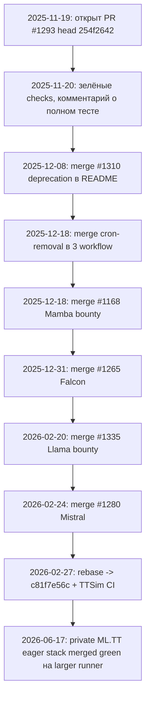

# Upstream drift: хронология конфликта PR #1293

Дата: 2026-06-18

## Verdict

Подготовленный staging-base `fix/tt_metal_bump` @ `c81f7e56c` - **тот же work product**, что был проверен в приватном `ML.TT.PyTorchTtnn` и в rebased `shutovilyaep#1`, но **не те же git SHA**, что у оригинального upstream head `254f2642` (Nov 2025). Конфликт на GitHub - следствие merge других PR в `main` поверх тех же файлов, пока `#1293` ждал review.

## Claim -> evidence -> experiment

| Claim | Evidence | Verdict |
| --- | --- | --- |
| PR `#1293` был зелёным и не смёржен | GitHub: `state=OPEN`, checks passed (C++ Extension Tests, validate-pr), комментарий 2025-11-20 о полном прогоне pipeline | Подтверждено |
| Maintainer мёржил другие PR в те же файлы | `#1310` (README), cron-removal (3 workflow), bounty PR (#1168, #1265, #1335, #1280) | Подтверждено (`git log`, таблица ниже) |
| Rebase уже поглотил drift | `f5e2fdc` и `ffd3b0e` - ancestors `c81f7e56c`; `shutovilyaep#1` = `MERGEABLE` | Подтверждено |
| Контент совпадает с оригинальной отправкой | 48/51 shared subjects - patch-id MATCH; eager reg - patch-id MATCH public vs private CI | Подтверждено с оговоркой (3 commit - rebase context) |

## Хронология



### Таблица merge, пересекающих файлы PR #1293

| Дата | Upstream merge | Автор | Файлы | Пересечение с #1293 |
| --- | --- | --- | --- | --- |
| 2025-12-08 | `#1310` deprecation | Joe Malone | `README.md`, `docs/README.md.in` | PR переписывает install/docs |
| 2025-12-18 | Remove cron jobs | Joe Malone | `run-accuracy-tests.yaml`, `update-readme.yaml`, `update-ttnn-wheel.yaml` | PR редактирует все три |
| 2025-12-18 | `#1168` Mamba 2.8B | pollachisaravanan | `README.md` metrics | PR переписывает `README.md` |
| 2025-12-31 | `#1265` Falcon 7B | Jamie Zhuang | `README.md` metrics | то же |
| 2026-02-20 | `#1335` Llama3 bounty | pollachisaravanan | `README.md` metrics | то же |
| 2026-02-24 | `#1280` Mistral 7B | Saïd | `README.md` metrics | то же |

PR #1293 vs `main` на момент открытия: **10 файлов** - `README.md` (+377/-), `docs/README.md.in` (+77/-), **8** workflow под `.github/workflows/`.

### «Шизофрения» на GitHub UI

Одновременно на PR #1293:

- комментарий автора (2025-11-20): полный pipeline протестирован (C++ build, dev install, tests, wheel, wheel tests);
- блок **3 successful checks** (логи CI уже expired);
- плашка **This branch has conflicts that must be resolved**.

Mechanism: `main` ушёл вперёд merge-ами maintainer в те же hunks, пока PR не rebased. Это не «недоделанный PR», а **outdated base** после чужих merge.

## SHA equivalence (измерено 2026-06-18)

### Base PR #1293 vs staging `fix/tt_metal_bump`

| Сравнение | SHA / метрика | Результат |
| --- | --- | --- |
| Original head | `254f2642` | Nov 2025 submission |
| Staging / shutovilyaep#1 head | `c81f7e56c` | rebased Feb 2026 |
| Same tip SHA? | `254f2642` vs `c81f7e56c` | **Нет** |
| Shared commit subjects | 51 в `#1293`, все есть в staging | **48/51** patch-id MATCH |
| 3 commit с patch-id DIFF | `build: modernize...`, Docker pin, CI checkbox | только rebase context, не новая логика |
| Staging vs `shutovilyaep#1` | оба `c81f7e56c` | **идентичный SHA**, GitHub `MERGEABLE` |

### Eager registration (ops stack)

| Слой | public vs private CI (`eager/*`) | public vs tenstorrent original |
| --- | --- | --- |
| Unary | patch-id **MATCH** | rebase context delta |
| Binary | patch-id **MATCH** | patch-id **MATCH** |
| Conv | patch-id **MATCH** | rebase context delta |
| Random | patch-id **MATCH** | rebase context delta |
| Reduction | patch-id **MATCH** | rebase context delta |

Private `ML.TT.PyTorchTtnn` PR #2-#6 (`eager/10-unary` .. `eager/50-reduction`) - тот же функциональный код, что `public/*`; tree diff только в `.github/workflows/run-cpp-native-tests.yaml` (larger-runner line vs TTSim line).

### Private repo vs staging (для утреннего merge)

| Private merged PR | Staging branch | Статус |
| --- | --- | --- |
| #1 `eager/00-base` | `fix/tt_metal_bump` | та же задача, другая base line (TTSim vs larger runner) |
| #2-#6 eager ops | `public/10-unary` .. `public/50-reduction` | patch-id MATCH на registration commits |
| #7-#11 release/pypi | `public/70-pypi` | консолидировано в один upstream PR |

## Что показывает rebase поверх maintainer merge

Rebased PR **сохраняет** deprecation header из `#1310` и **восстанавливает** install/CI изменения автора поверх. Пример hunk из `#1310`, уже в `c81f7e56c`:

```diff
 # PyTorch 2.0 TTNN Compiler
+# Visit [TT-Forge](https://github.com/tenstorrent/tt-forge) for our latest compiler project
+
+**Pytorch 2.0 TT-NN** is no longer maintained, please consider using [TT-Forge](https://github.com/tenstorrent/tt-forge) instead.
+
 The PyTorch 2.0 TT-NN Compiler enables seamless execution...
```

Cron lines из `ffd3b0e` reconciled в workflow; **нет** отдельных «conflict resolution» commits, меняющих build/CI semantics.

## Команды воспроизведения

```bash
# fetch original submission
git fetch github pull/1293/head:refs/remotes/github/pr-1293-head

# shared subjects + patch-id
git log --format=%s github/main..github/pr-1293-head
git log --format=%s github/main..fix/tt_metal_bump

# tree diff ops stack
git diff --stat eager/50-reduction public/50-reduction
```

## Связанные артефакты

- PR body (English): [pr_bodies/01-base.md](pr_bodies/01-base.md) - секция «Upstream drift»
- Runbook: [RUNBOOK_ru.md](RUNBOOK_ru.md)
